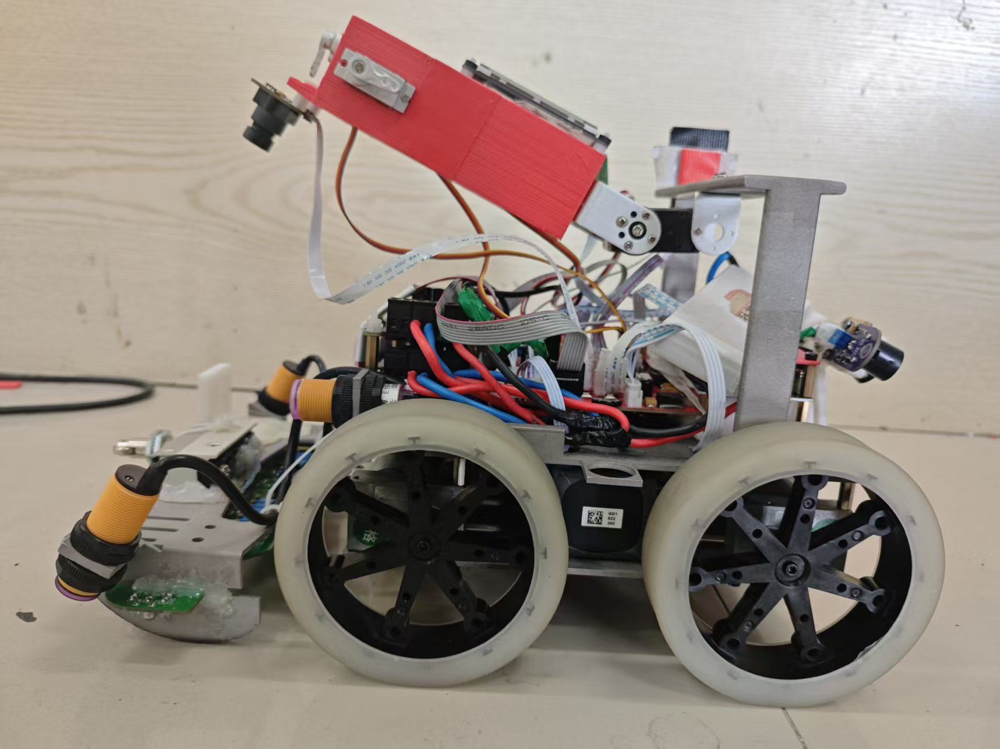
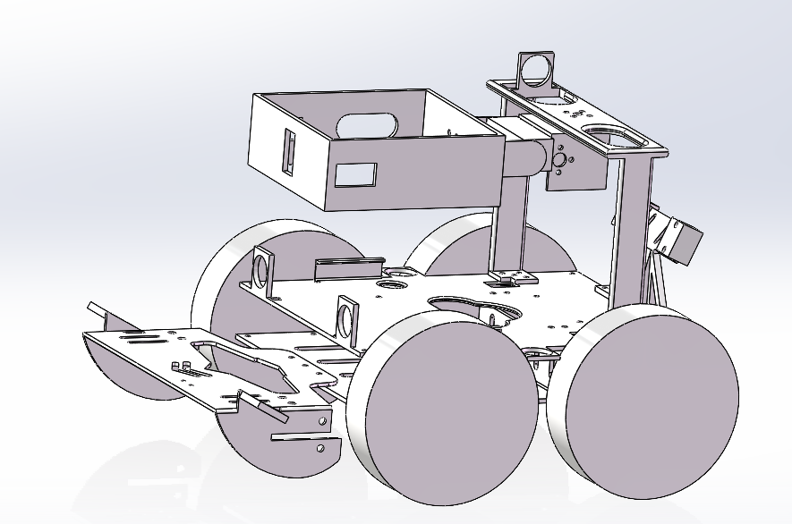
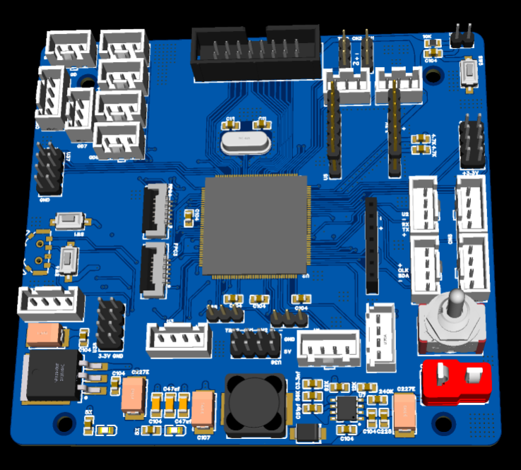

# TianXian · 车型探险机器人

> 主控 STM32F407ZGT6 + MaixCam 视觉，四轮底盘，完成「巡线 → 越障/过桥 → 识别景点数字 → 语音播报 → 返程」全流程的竞赛机器人开源工程。
>
> 包含：STM32 固件（HAL 库 + Keil 工程）、视觉模型与部署脚本、机械结构（SolidWorks）、PCB（立创 EDA）。

<p align="center">
  
  <br>
  <em>整车实物</em>
</p>

| 机械结构（3D 预览） | 主控 PCB（3D 预览） |
| :---: | :---: |
|  |  |

**[▶ 演示视频（Bilibili，V1）](https://www.bilibili.com/video/BV1UiGg6rEV1/)**

---

## 一、项目简介

机器人以「五岳景点打卡」为任务背景：沿场地循迹行进，途中完成上/下阶梯、过桥、上下平台等动作，用摄像头识别景点编号（1~5），通过语音模块播报「到达东岳泰山 / 西岳华山 / 南岳衡山 / 北岳恒山 / 中岳嵩山」，最后回到起点。

- **主控**：STM32F407ZGT6（LQFP144，168 MHz）
- **底盘**：4 × 带编码器减速电机（四轮独立速度闭环）
- **视觉**：MaixCam 运行 YOLOv5（224×224，5 类），UART 回传识别结果
- **导航**：12 路灰度 + 2 路线性 CCD 巡线，HWT101 陀螺仪航向闭环，光电/激光/微动开关做定位与触发
- **交互**：TJC 串口屏菜单选模式、SYN6288 语音播报、VOFA+ 上位机调参

## 二、功能特性

| 能力 | 实现 |
| --- | --- |
| 巡线 | 12 路灰度 `Huidu_findline` + 2 路线性 CCD `CcdFindLine2`，分段 PID（按速度切换 5 套参数） |
| 运动控制 | 4 路电机速度环 PID（`htim6` 1 ms 中断）+ 编码器里程计 + 陀螺仪角度环 PID |
| 动作原语 | `go / go_enco / go_time / go_GD / go_acc / HWT101_go / HWT101_go_rotate` 等，支持自定义终止回调 |
| 任务编排 | `part1_pro ~ part4_pro` 四段路线，配合 `flagroad_0~4` 岔路标记位 |
| 视觉识别 | MaixCam YOLOv5 数字识别，稳定 4 帧后才发送，超时自动复 0 |
| 语音播报 | SYN6288 合成播报，首次识别结果缓存至 `ZL[5]`，二次经过直接复播 |
| 调试工具 | 串口屏菜单 16 种模式、VOFA+ 实时波形、`keilkill.bat` 清理编译中间产物 |

## 三、目录结构

```
.
├── 代码/stm32代码HAL库/
│   ├── Core/                 # CubeMX 生成的时钟/外设初始化与 main.c
│   ├── Drivers/              # STM32F4 HAL 库、CMSIS
│   ├── Hard-and-Software/    # 本项目全部应用层代码（见下表）
│   ├── MDK-ARM/              # Keil uVision 工程（TianXian.uvprojx）
│   ├── Camera/               # MaixCam 视觉应用与模型
│   │   ├── 2.0-es/           # 早期模型 316024
│   │   ├── 2.2-es/           # 模型 316110
│   │   └── 2.3/              # 推荐版本：2.0-es 逻辑 + 316110 模型
│   ├── TianXian.ioc          # STM32CubeMX 配置（外设/引脚/时钟）
│   └── keilkill.bat          # 清理 Keil 编译中间文件
├── 结构/                      # SolidWorks 零件与装配体（.SLDPRT/.SLDASM/STL）
├── PCB/
│   └── PCB.eprj2             # 立创 EDA 专业版工程
├── docs/images/              # README 用预览图（整车实物、机械结构、PCB 3D 渲染）
└── README.md
```

### 应用层模块（`Hard-and-Software/`）

| 文件 | 职责 |
| --- | --- |
| `sys.c/h` | 全局头文件聚合、`CAR_STRUCT` 车体状态结构体、`Para_Init` 参数初始化 |
| `move.c/h` | 电机 PWM 输出、编码器/速度采集、速度环与角度环 PID |
| `base.c/h` | 运动原语：定距、定时、加速、灰度终止、陀螺仪转向等 |
| `private.c/h` | 任务流程：`Ready / LBridge / to5 / gohome` 等，以及 `part1~4_pro` |
| `Huidu.c/h` | 12 路灰度寻线偏差计算 |
| `CCD.c/h` | 线性 CCD 时序驱动、自动曝光、寻线与 CCD 巡线 PID |
| `HWT101.c/h` | 软件 I²C 读取 HWT101 陀螺仪、角度标定 |
| `Kalman.c/h` | 传感器数据卡尔曼滤波 |
| `GD.c/h` | 光电/激光/微动开关等数字量输入 |
| `HSL.c/h` | 颜色传感器（软件 I²C） |
| `DJ.c/h` | 舵机动作组：身体、摄像头云台、左右手 |
| `myusart.c/h` | printf 重定向、MaixCam 协议解析、SYN6288 语音帧组包 |
| `Serial.c/h` | `Serial.HMI`（串口屏）/ `Serial.Vofa`（VOFA+）格式化输出 |
| `key.c/h` | 按键扫描与运行模式选择 |
| `Timer.c/h` | 定时器中断回调（控制 / 采集 / 计时） |

## 四、硬件与引脚分配

| 外设 | 引脚 / 资源 | 说明 |
| --- | --- | --- |
| 电机 PWM | TIM4 CH1~CH4（轮 1/2）、TIM5 CH1~CH4（轮 3/4） | 每轮两路 PWM 实现正反转 |
| 编码器 | TIM1 / TIM2 / TIM3 / TIM8（编码器模式） | 4 路 AB 相 |
| 舵机 | TIM9 CH1/CH2（身体、云台）、TIM12 CH1/CH2（右手、左手） | 50 Hz |
| 灰度传感器 | ADC3 + DMA2_Stream0，12 通道扫描 | `AD_value[12]` |
| 线性 CCD ×2 | CCD1：CLK=PG0、SI=PG1；CCD2：CLK=PE7、SI=PE8；ADC2 CH4/CH5 | TSL1401 类 128 像素 |
| 陀螺仪 HWT101 | 软件 I²C：SDA=PE0、SCL=PE1 | 航向角闭环 |
| 颜色传感器 HSL | SDA=PD2、SCL=PD3 | |
| 光电开关 | GD1=PA6、GD2=PA7、GD5=PC4、GD6=PC5、GD7=PB0、GD8=PB1 | 定位/计数 |
| 激光对射 | JG1=PE2、JG2=PE3 | |
| 微动开关 | QC1=PC13 | 到位检测 |
| 按键 ×4 | KEY_LEFT=PD8、KEY_MID=PD9、KEY_RIGHT=PD10、KEY1=PD11 | 模式选择 |
| USART1 | PA9/PA10 | TJC 串口屏 + `printf` 重定向 |
| USART2 | PD5/PD6 | MaixCam 数据接收（RX）+ VOFA+（TX），115200 |
| USART3 | PB10/PB11 | SYN6288 语音合成模块 |
| 定时器 | TIM6 控制（1 ms）、TIM7 采集（1 ms）、TIM10 计时 | |

## 五、编译与烧录

1. **环境**
   - Keil MDK-ARM **V5.32** 及以上，安装 STM32F4 器件支持包
   - STM32CubeMX（本项目基于 `STM32Cube FW_F4 V1.28.1` 生成）
2. 打开 `代码/stm32代码HAL库/MDK-ARM/TianXian.uvprojx`，编译（Target: TianXian）后通过 ST-Link 下载。
3. 修改外设配置时用 CubeMX 打开 `TianXian.ioc` 重新生成即可（用户代码写在 `USER CODE BEGIN/END` 之间，不会被覆盖）。
4. 提交仓库前建议运行 `keilkill.bat` 清理 `Objects/`、`Listings/` 等中间文件。

## 六、视觉模型部署（MaixCam）

1. 将 `Camera/2.3/` 下 `app.yaml`、`main.py`、`app.png`、`model_316110.mud`（或 `.cvimodel`）、`report.json` 打包，在 [MaixHub](https://maixhub.com) 部署或直接用 MaixVision 安装到设备。
2. 模型：YOLOv5n 级检测模型，输入 224×224，5 类，验证集准确率 0.982（`report.json`）。
3. **通信协议**：串口 `/dev/ttyS0`，115200，帧格式 `0xAA + ASCII('0'~'5') + 0xBB`
   - `'1'~'5'` 对应 东岳泰山 / 西岳华山 / 南岳衡山 / 北岳恒山 / 中岳嵩山（注意模型类序为 `3,4,5,1,2`，代码已做映射）
   - `'0'` 表示未识别到目标
   - 连续 4 帧同一结果才发送，之后每 10 帧补发一次；连续 60 帧无目标则发送 `'0'`

> 需要重新训练模型时，在 MaixHub 上传标注数据集（5 类）即可，导出后替换 `model_*.mud` 并同步 `CLASS_TO_NUMBER`。

## 七、运行与调试

1. 上电后串口屏显示模式选择界面：`左/右` 键切换编号（1~16），`中` 键确认，`KEY1` 直接跳到模式 5。
2. 常用模式（`main.c` 中 `Function_Value`）：

| 模式 | 功能 |
| --- | --- |
| 1 | 完整跑图（part1→part4 执行两轮） |
| 2 | 单轮跑图 |
| 3 | 灰度 / CCD 巡线调试 |
| 4 | HWT101 陀螺仪 + 光电调试 |
| 5 | 综合调试：串口屏显示 + 摄像头读取 |
| 6 | 摄像头识别 + 语音播报测试 |
| 8 | 直行测试 |

3. 调参入口集中在 `sys.c` 的 `Para_Init()`（灰度阈值 `ADW[]`、多套巡线 PID、速度/角度 PID）与 `move.c` 的 PID 实现；实时波形用 VOFA+ 打开 USART2 对应串口查看。

## 八、机械与硬件

| 机械结构 | 主控 PCB |
| :---: | :---: |
|  |  |

- `结构/`：`装配体2.SLDASM` 为整机装配，其余为车身、电机底盘、舵机支架、轮子、CCD 支架、喇叭等零件，另附 `升级版ccd.STL` 可直接 3D 打印。
- `PCB/PCB.eprj2`：立创 EDA 专业版工程，直接导入即可查看/打样。

## 九、演示视频

- **V1 完整流程演示**：<https://www.bilibili.com/video/BV1UiGg6rEV1/> ｜ BV 号 `BV1UiGg6rEV1`

> GitHub / Gitee 会过滤 `<iframe>` 标签，仓库内统一使用上面的链接形式。若要在支持内嵌的站点（自建博客、语雀等）展示，可用 B 站提供的嵌入代码：
>
> ```html
> <iframe src="//player.bilibili.com/player.html?isOutside=true&aid=117019370329649&bvid=BV1UiGg6rEV1&cid=40498958082&p=1" scrolling="no" border="0" frameborder="no" framespacing="0" allowfullscreen="true"></iframe>
> ```

## 十、开源协议

本项目采用 **MIT License**。第三方组件遵循各自许可证：

- `Drivers/` 下 STM32 HAL / CMSIS 遵循 ST 官方许可；
- `Camera/` 下模型与脚本由 MaixHub 生成，遵循 Sipeed / MaixHub 相关条款。

> 提示：若需正式开源，请在仓库根目录补充 `LICENSE` 文件与 `.gitignore`（忽略 `MDK-ARM/Objects`、`Listings`、`*.uvguix.*` 等），并删除 `*.uvguix.*` 中的个人用户信息。

## 十一、致谢

- STMicroelectronics：STM32CubeMX / HAL 库
- Sipeed MaixHub / MaixCam：模型训练与部署平台
- 维特智能 HWT101、SYN6288 语音模块、淘晶驰 TJC 串口屏、VOFA+ 上位机

